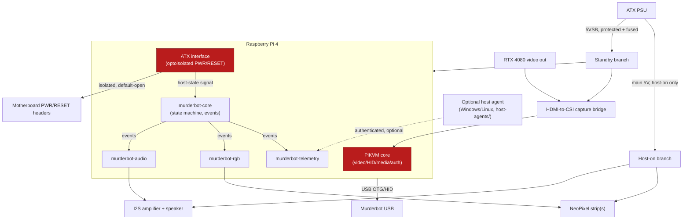
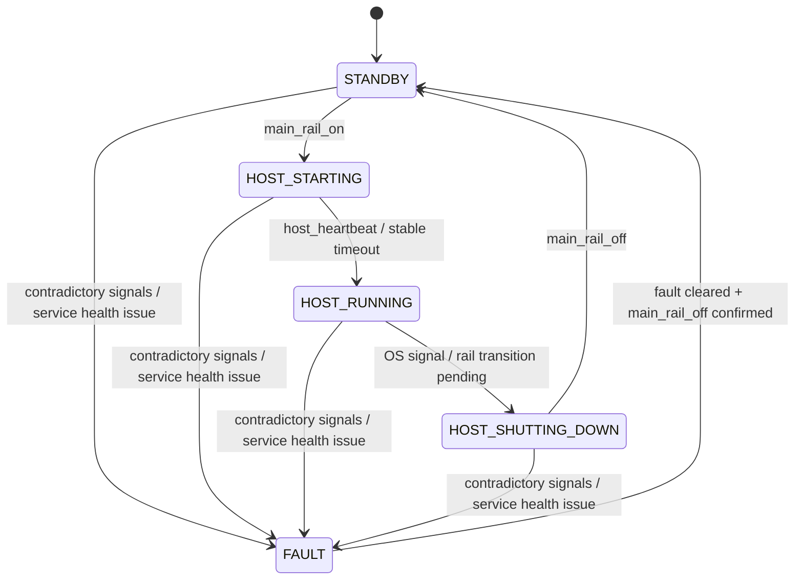

# Architecture

## Design intent

Build a clean, extensible internal management controller — a lightweight
baseboard management controller (BMC), not a collection of unrelated
adapters. PiKVM remains the critical service; every other subsystem
("personality" features: audio, RGB, telemetry) is separated so its
failure cannot take PiKVM or ATX control down with it.

## Power topology

Two electrically separate branches, both ultimately fed from the host
PSU, with different availability guarantees:

- **Standby branch** — powered whenever the PSU is connected and the rear
  switch is on, independent of host power state. Feeds the Pi, capture
  bridge, network, and ATX control logic. This is what makes MSC available
  "whenever the ATX power supply is connected, even while the host computer
  is shut down" (FR-01).
- **Host-on branch** — powered only when the motherboard commands the PSU
  on. Feeds NeoPixels, the audio amplifier, and any future
  display/sensors. Kept separate so higher-current, less-critical loads
  never share a fuse or supply with the standby branch, and so audio/RGB
  are physically incapable of drawing power while the host (and thus the
  user's attention) is off.

See `docs/power-design.md` for the (currently `TBD`, pending measurement)
current/fusing budget for each branch.

## Component diagram

Red nodes (PiKVM core, ATX interface) are the critical failure domain —
see below.

## Failure domains and rules

| Subsystem | Responsibility | Failure rule |
|---|---|---|
| PiKVM core | Video capture, HID, virtual media, web interface, authentication | Highest priority; custom code must not modify or block it. |
| ATX interface | Power/reset pulses and state feedback | Fail open; no asserted switch state after process crash. |
| Personality core (`murderbot-core`) | State machine, event routing, profiles, logs | May restart independently. |
| Audio service | Clip selection and I²S playback | Must remain muted/off if unavailable. |
| RGB service | Animations, brightness limits, host-state visualization | Must default off on configuration or hardware error. |
| Host agent | Optional CPU/GPU/OS telemetry from Windows or Linux | System remains fully useful without it. |

**Enforcement, not just convention:** these rules are implemented as
separate systemd units (`services/systemd/`) with independent restart
policies, and as separate Python packages under
`services/src/murderbot_core/` communicating only through the event bus
(`events.py`) — never through direct imports of PiKVM internals or shared
mutable state. See `docs/software.md` for the service boundaries and
`AGENTS.md` rule 4.

## State model

Events: `power_button`, `reset_button`, `main_rail_on`, `main_rail_off`,
`host_windows`, `host_linux`, `host_heartbeat`, `temperature_warning`,
`pikvm_degraded`, `audio_complete`, `animation_complete`.

**Invariant:** a `murderbot-core` process restart must never itself pulse
power/reset, play audio, or illuminate LEDs — only a real, re-observed
hardware event may do that. This is enforced in the state machine
implementation (`services/src/murderbot_core/state_machine.py`) and is
covered by unit tests in `tests/test_state_machine.py`.

## Why one Pi 4 for both PiKVM and personality services

See `docs/decisions/0001-service-core-architecture.md` for the full
rationale and alternatives considered (a second microcontroller for
personality features, an ESP32 co-processor, etc.).

## Relationship to the original engineering report

This document supersedes engineering-report §4 with a Mermaid rendering
and folds in the roadmap's post-1.0 layers (REST API, dashboard, plugin
architecture) as dashed/future nodes only where they attach to the
existing event bus — no new hardware I/O paths are implied for those until
their own ADRs exist.
